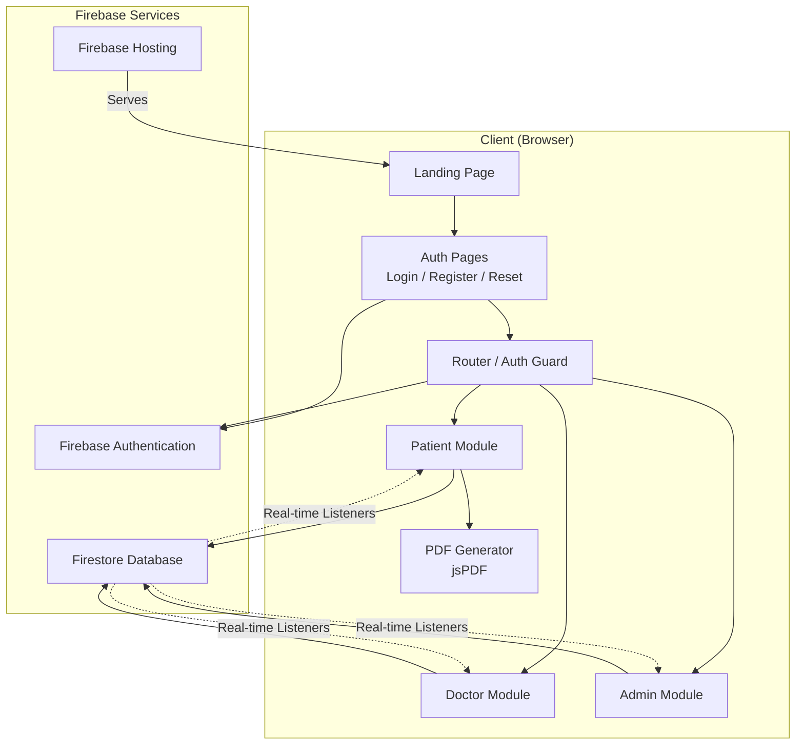

# Design Document: Clinic Management App

## Overview

A multi-role clinic management web application built with vanilla HTML/CSS/JavaScript and Firebase (Authentication, Firestore, Hosting). The system supports three user roles — Patient, Doctor, and Admin — each with dedicated modules. Patients self-register, submit health problems, view appointments/prescriptions, and request follow-ups. Admins review pending requests, assign patients to doctors with scheduled dates/times (with conflict checking), and oversee all appointments. Doctors view assigned patients, review patient history, and prescribe medicines (immutable once submitted). The app includes real-time notifications via Firestore listeners, role-based access control, search/filter on dashboards, PDF prescription export, password reset, and responsive layout.

## Architecture

The application follows a client-side rendered, single-page-per-module architecture with Firebase as the backend-as-a-service.



### Key Architectural Decisions

1. **Multi-page app with shared modules**: Each role gets its own HTML page(s). Shared JS modules handle auth, Firestore operations, and notifications. This avoids SPA framework complexity while keeping code organized.

2. **Firebase as sole backend**: No custom server. Firestore security rules enforce role-based access at the database level. Firebase Auth handles all identity management.

3. **Client-side PDF generation**: Using jsPDF (loaded via CDN) to generate prescription PDFs entirely in the browser — no server-side rendering needed.

4. **Real-time via Firestore onSnapshot**: Notifications and dashboard stats use Firestore real-time listeners rather than polling.

5. **Pre-provisioned accounts**: Doctor and Admin accounts are created directly in Firebase Console or via a seed script. The registration page only creates Patient accounts.

## Components and Interfaces

### File Structure

```
/
├── index.html                  # Landing page
├── login.html                  # Login page
├── register.html               # Patient registration
├── reset-password.html         # Password reset
├── patient/
│   ├── dashboard.html          # Patient dashboard
│   ├── submit-problem.html     # Problem submission form
│   ├── appointments.html       # Appointment list
│   ├── prescriptions.html      # Prescription list
│   ├── profile.html            # Patient profile (editable)
│   └── notifications.html      # Notifications page
├── doctor/
│   ├── dashboard.html          # Doctor dashboard
│   ├── patient-details.html    # Patient details + history + prescribe
│   └── notifications.html      # Notifications page
├── admin/
│   ├── dashboard.html          # Admin dashboard
│   ├── assign.html             # Assignment page (doctor select, date/time)
│   └── notifications.html      # Notifications page
├── css/
│   ├── style.css               # Global styles + responsive layout
│   └── print.css               # Print-friendly prescription styles
├── js/
│   ├── firebase-config.js      # Firebase initialization
│   ├── auth.js                 # Auth functions (login, register, logout, reset)
│   ├── auth-guard.js           # Route protection + role-based redirect
│   ├── firestore.js            # Firestore CRUD operations
│   ├── notifications.js        # Notification creation + real-time listener
│   ├── search-filter.js        # Search and filter logic
│   ├── pdf-export.js           # jsPDF prescription export
│   ├── validation.js           # Form validation utilities
│   └── utils.js                # Date formatting, DOM helpers
└── firebase.json               # Firebase Hosting config
```


### Module Interfaces

#### `js/firebase-config.js`
Initializes Firebase app and exports shared instances.

```javascript
// Exports:
//   app       - Firebase App instance
//   auth      - Firebase Auth instance
//   db        - Firestore instance
```

#### `js/auth.js`
Handles all authentication operations.

```javascript
// Functions:
//   registerPatient(name, email, password) → Promise<void>
//     Creates Firebase Auth user, writes Firestore user doc with role "patient"
//
//   loginUser(email, password) → Promise<{uid, role}>
//     Signs in via Firebase Auth, fetches role from Firestore
//
//   logoutUser() → Promise<void>
//     Signs out and redirects to landing page
//
//   sendPasswordReset(email) → Promise<void>
//     Calls Firebase sendPasswordResetEmail
//
//   getCurrentUser() → Promise<{uid, email, role, name} | null>
//     Returns current auth user with Firestore profile data
```

#### `js/auth-guard.js`
Protects pages based on authentication state and role.

```javascript
// Functions:
//   requireAuth(allowedRole) → Promise<{uid, role, name}>
//     Called on page load. Redirects to login if not authenticated.
//     Redirects to role-specific dashboard if role doesn't match allowedRole.
```

#### `js/firestore.js`
All Firestore read/write operations.

```javascript
// Problem Submissions:
//   createProblemSubmission(patientId, title, description, type?, originalAppointmentId?) → Promise<string>
//   getPendingSubmissions() → Promise<Array>
//   getSubmissionsByPatient(patientId) → Promise<Array>
//   updateSubmissionStatus(submissionId, status) → Promise<void>
//
// Appointments:
//   createAppointment(patientId, doctorId, submissionId, date, time) → Promise<string>
//   getAppointmentsByPatient(patientId) → Promise<Array>
//   getAppointmentsByDoctor(doctorId) → Promise<Array>
//   getAllAppointments() → Promise<Array>
//   updateAppointmentStatus(appointmentId, status) → Promise<void>
//   checkDoctorConflict(doctorId, date, time) → Promise<boolean>
//
// Prescriptions:
//   createPrescription(appointmentId, patientId, doctorId, medicines, notes) → Promise<string>
//   getPrescriptionsByPatient(patientId) → Promise<Array>
//   getPrescriptionsByAppointment(appointmentId) → Promise<Array>
//
// Users:
//   getDoctorList() → Promise<Array>
//   getUserProfile(uid) → Promise<Object>
//   updatePatientProfile(uid, data) → Promise<void>
//   getPatientHistory(patientId) → Promise<{appointments, prescriptions}>
//
// Real-time listeners:
//   onSubmissionsChange(callback) → unsubscribe function
//   onAppointmentsChange(doctorId|patientId, role, callback) → unsubscribe function
//   onStatsChange(role, userId, callback) → unsubscribe function
```

#### `js/notifications.js`
Notification creation and real-time display.

```javascript
// Functions:
//   createNotification(userId, message, type) → Promise<void>
//   onNotificationsChange(userId, callback) → unsubscribe function
//   markAsRead(notificationId) → Promise<void>
//   getUnreadCount(userId) → Promise<number>
//   setupNotificationBadge(userId) → void
//     Attaches real-time listener to update badge count in nav
```

#### `js/search-filter.js`
Client-side search and filter for dashboard lists.

```javascript
// Functions:
//   filterByText(items, searchText, fieldName) → Array
//     Filters items where fieldName contains searchText (case-insensitive)
//
//   filterByStatus(items, status) → Array
//     Filters items by status field value
//
//   applyFilters(items, searchText, searchField, status) → Array
//     Combines text search and status filter
//
//   setupSearchFilter(listElement, renderFn, items, searchField) → void
//     Wires up search input and status dropdown to re-render list
```

#### `js/pdf-export.js`
PDF generation for prescriptions.

```javascript
// Functions:
//   generatePrescriptionPDF(prescription) → void
//     Uses jsPDF to create and download a PDF with clinic header,
//     doctor/patient names, date, medicines table, and notes
//
//   printPrescription(prescription) → void
//     Opens browser print dialog with print-friendly view
```

#### `js/validation.js`
Reusable form validation.

```javascript
// Functions:
//   validateRequired(value, fieldName) → string | null
//     Returns error message if empty/whitespace, null if valid
//
//   validateEmail(email) → string | null
//     Returns error message if invalid format
//
//   validatePassword(password) → string | null
//     Returns error message if too short (min 6 chars for Firebase)
//
//   showFieldError(inputElement, message) → void
//     Displays error message next to input
//
//   clearFieldErrors(formElement) → void
//     Removes all error messages from form
//
//   validateForm(fields) → {isValid: boolean, errors: Object}
//     Validates array of {value, fieldName, validators} objects
```

## Data Models

All data is stored in Firestore. Below are the collection schemas.

### `users` Collection

```
users/{uid}
{
  uid: string,              // Firebase Auth UID
  name: string,             // Full name
  email: string,            // Email address
  role: "patient" | "doctor" | "admin",
  phone: string,            // Contact phone (optional, patients)
  address: string,          // Address (optional, patients)
  createdAt: Timestamp      // Account creation time
}
```

### `problemSubmissions` Collection

```
problemSubmissions/{submissionId}
{
  patientId: string,        // Reference to users/{uid}
  patientName: string,      // Denormalized for display
  title: string,            // Problem title
  description: string,      // Detailed description
  status: "pending" | "assigned",
  type: "initial" | "follow-up",
  originalAppointmentId: string | null,  // For follow-ups, reference to original appointment
  createdAt: Timestamp
}
```

### `appointments` Collection

```
appointments/{appointmentId}
{
  patientId: string,        // Reference to users/{uid}
  patientName: string,      // Denormalized
  doctorId: string,         // Reference to users/{uid}
  doctorName: string,       // Denormalized
  submissionId: string,     // Reference to problemSubmissions/{id}
  problemTitle: string,     // Denormalized
  problemDescription: string, // Denormalized
  scheduledDate: string,    // "YYYY-MM-DD" format
  scheduledTime: string,    // "HH:MM" 24-hour format
  status: "assigned" | "prescribed" | "completed" | "cancelled",
  createdAt: Timestamp
}
```

### `prescriptions` Collection

```
prescriptions/{prescriptionId}
{
  appointmentId: string,    // Reference to appointments/{id}
  patientId: string,        // Reference to users/{uid}
  patientName: string,      // Denormalized
  doctorId: string,         // Reference to users/{uid}
  doctorName: string,       // Denormalized
  medicines: [
    {
      name: string,         // Medicine name
      dosage: string,       // e.g., "500mg"
      frequency: string     // e.g., "Twice daily"
    }
  ],
  notes: string,            // Additional instructions
  createdAt: Timestamp
}
```

### `notifications` Collection

```
notifications/{notificationId}
{
  userId: string,           // Target user ID
  message: string,          // Notification text
  type: "assignment" | "prescription" | "request" | "cancellation" | "completion",
  read: boolean,            // Read status
  createdAt: Timestamp
}
```

### Firestore Security Rules (Key Rules)

```javascript
rules_version = '2';
service cloud.firestore {
  match /databases/{database}/documents {

    // Users: read own profile, patients can update own profile
    match /users/{uid} {
      allow read: if request.auth != null && 
        (request.auth.uid == uid || getUserRole() == "admin" || getUserRole() == "doctor");
      allow update: if request.auth.uid == uid && getUserRole() == "patient";
    }

    // Problem Submissions: patients create own, admin reads all
    match /problemSubmissions/{docId} {
      allow create: if getUserRole() == "patient" && request.resource.data.patientId == request.auth.uid;
      allow read: if request.auth != null && 
        (resource.data.patientId == request.auth.uid || getUserRole() == "admin");
      allow update: if getUserRole() == "admin";
    }

    // Appointments: admin creates, relevant users read, status updates by role
    match /appointments/{docId} {
      allow create: if getUserRole() == "admin";
      allow read: if request.auth != null && 
        (resource.data.patientId == request.auth.uid || 
         resource.data.doctorId == request.auth.uid || 
         getUserRole() == "admin");
      allow update: if request.auth != null;
    }

    // Prescriptions: doctors create, relevant users read, no updates (immutable)
    match /prescriptions/{docId} {
      allow create: if getUserRole() == "doctor";
      allow read: if request.auth != null && 
        (resource.data.patientId == request.auth.uid || 
         resource.data.doctorId == request.auth.uid || 
         getUserRole() == "admin");
    }

    // Notifications: system creates, users read/update own
    match /notifications/{docId} {
      allow create: if request.auth != null;
      allow read, update: if request.auth.uid == resource.data.userId;
    }

    function getUserRole() {
      return get(/databases/$(database)/documents/users/$(request.auth.uid)).data.role;
    }
  }
}
```

### Firestore Indexes

Composite indexes needed for queries:

| Collection | Fields | Order |
|---|---|---|
| `problemSubmissions` | `status`, `createdAt` | ASC, DESC |
| `appointments` | `doctorId`, `scheduledDate`, `scheduledTime` | ASC, ASC, ASC |
| `appointments` | `patientId`, `createdAt` | ASC, DESC |
| `appointments` | `doctorId`, `createdAt` | ASC, DESC |
| `prescriptions` | `patientId`, `createdAt` | ASC, DESC |
| `notifications` | `userId`, `read`, `createdAt` | ASC, ASC, DESC |


## Correctness Properties

*A property is a characteristic or behavior that should hold true across all valid executions of a system — essentially, a formal statement about what the system should do. Properties serve as the bridge between human-readable specifications and machine-verifiable correctness guarantees.*

### Property 1: Patient registration always assigns patient role with correct fields

*For any* valid registration input (name, email, password), the resulting Firestore user document should have `role` set to `"patient"`, and contain the provided `name` and `email` fields. No registration path should produce a document with role `"doctor"` or `"admin"`.

**Validates: Requirements 2.2, 3.3**

### Property 2: Form validation rejects empty/whitespace required fields

*For any* form (registration, problem submission, prescription, follow-up, profile) and *for any* input where a required field is empty or composed entirely of whitespace, the `validateRequired` function should return a non-null error message, and the form submission should be prevented.

**Validates: Requirements 2.4, 5.3, 11.5**

### Property 3: Role-based redirect after login

*For any* authenticated user with role R ∈ {"patient", "doctor", "admin"}, the login redirect function should return the URL corresponding to R's dashboard (patient → `/patient/dashboard.html`, doctor → `/doctor/dashboard.html`, admin → `/admin/dashboard.html`).

**Validates: Requirements 4.2**

### Property 4: Problem submission creates record with correct fields and pending status

*For any* valid problem title and description submitted by a patient, the created `problemSubmissions` document should contain the patient's ID, the provided title and description, a `createdAt` timestamp, and `status` set to `"pending"`.

**Validates: Requirements 5.2**

### Property 5: Owner-based data filtering returns only the owner's records

*For any* user ID and *for any* collection (appointments, prescriptions, problem submissions), querying by that user's ID should return only documents where the owner field (patientId or doctorId) matches the queried user ID. No document belonging to a different user should appear in the results.

**Validates: Requirements 8.1, 9.1, 12.1**

### Property 6: Pending submissions filter returns only pending items

*For any* set of problem submissions with mixed statuses, filtering by status `"pending"` should return exactly those submissions where `status === "pending"`. Follow-up submissions with status `"pending"` should also be included.

**Validates: Requirements 6.1, 13.4**

### Property 7: Assignment creates appointment with correct references and updates submission status

*For any* valid assignment (patientId, doctorId, submissionId, date, time), the created appointment document should contain all five references correctly, and the linked problem submission's status should be updated to `"assigned"`.

**Validates: Requirements 7.3, 7.4**

### Property 8: Doctor conflict check correctness

*For any* doctor with an existing appointment at date D and time T, `checkDoctorConflict(doctorId, D, T)` should return `true`. *For any* doctor with no appointment at date D and time T, `checkDoctorConflict(doctorId, D, T)` should return `false`. When a conflict is detected, the assignment should be blocked.

**Validates: Requirements 18.1, 18.3, 18.4**

### Property 9: Appointment status transitions are valid

*For any* appointment, the following state transitions should be the only valid ones: `"assigned" → "prescribed"` (when prescription is created), `"assigned" → "cancelled"` (when patient cancels), `"prescribed" → "completed"` (when doctor marks complete). After a transition, the Firestore document's status field should reflect the new status.

**Validates: Requirements 7.4, 11.4, 17.1, 17.3, 17.5**

### Property 10: Prescription immutability

*For any* existing prescription document in Firestore, no update operation should be permitted. The Firestore security rules should deny all write operations on existing prescription documents (only create is allowed).

**Validates: Requirements 11.6**

### Property 11: Prescription supports multiple medicines

*For any* positive integer N (1 ≤ N ≤ 20), creating a prescription with N medicines should result in a document whose `medicines` array has exactly N entries, each containing `name`, `dosage`, and `frequency`.

**Validates: Requirements 11.2**

### Property 12: Follow-up request creates submission with correct type and reference

*For any* valid follow-up request on an appointment with status `"prescribed"`, the created problem submission should have `type` set to `"follow-up"`, `status` set to `"pending"`, and `originalAppointmentId` set to the source appointment's ID.

**Validates: Requirements 13.3**

### Property 13: Event-driven notification creation

*For any* of the following events, the correct notification(s) should be created for the correct recipient(s):
- Assignment → notification to patient AND doctor
- Prescription created → notification to patient
- Problem submission/follow-up → notification to admin
- Cancellation → notification to doctor AND admin
- Completion → notification to patient

**Validates: Requirements 14.1, 14.2, 14.3, 14.4, 17.7, 17.8**

### Property 14: Notification unread count accuracy

*For any* user with N total notifications where M are unread (`read === false`), the `getUnreadCount` function should return M. After marking one notification as read, the count should return M - 1.

**Validates: Requirements 14.5, 14.7**

### Property 15: Notifications ordered by date descending

*For any* list of notifications for a user, the returned list should be sorted by `createdAt` in descending order (most recent first).

**Validates: Requirements 14.6**

### Property 16: Unauthenticated access redirects to login

*For any* protected page URL (any page under `/patient/`, `/doctor/`, or `/admin/`), when no user is authenticated, the auth guard should redirect to `/login.html`.

**Validates: Requirements 15.1**

### Property 17: Role-based access control prevents cross-role access

*For any* authenticated user with role R and *for any* page belonging to role S where R ≠ S, the auth guard should redirect the user to their own role-specific dashboard.

**Validates: Requirements 15.2, 15.3, 15.4, 15.5**

### Property 18: Combined search and status filter

*For any* list of items (submissions or appointments), *for any* search text string, and *for any* status value, `applyFilters(items, searchText, searchField, status)` should return exactly those items where the search field contains the search text (case-insensitive) AND the status matches. When search text is empty and status is null/empty, the full list should be returned.

**Validates: Requirements 16.2, 16.3, 16.4, 16.6, 16.7, 16.8**

### Property 19: Status-driven action button visibility

*For any* appointment, the "Cancel Appointment" button should be visible if and only if `status === "assigned"` AND `scheduledDate` is in the future. The "Mark as Completed" button should be visible if and only if `status === "prescribed"`. The "Request Follow-Up" button should be visible if and only if `status === "prescribed"`.

**Validates: Requirements 13.1, 17.2, 17.4**

### Property 20: Admin views all appointments regardless of status

*For any* set of appointments with mixed statuses (assigned, prescribed, completed, cancelled), the admin's `getAllAppointments()` query should return all of them with no status-based filtering.

**Validates: Requirements 17.6**

### Property 21: Patient history ordered by date descending

*For any* patient's history entries (appointments and prescriptions), the returned list should be sorted by date in descending order (most recent first).

**Validates: Requirements 10.4**

### Property 22: Patient profile update round-trip

*For any* valid profile update (name, phone, address), after saving to Firestore and re-reading the document, the returned values should match the submitted values.

**Validates: Requirements 19.2**

### Property 23: Patient profile is read-only for non-patient roles

*For any* doctor or admin viewing a patient's profile, the Firestore security rules should deny update operations from users whose UID does not match the profile's UID.

**Validates: Requirements 19.4, 19.5**

### Property 24: Prescription PDF contains all required fields

*For any* prescription, the generated PDF content should include the clinic name, generation date, doctor name, patient name, prescription date, and for each medicine: name, dosage, and frequency, plus additional notes.

**Validates: Requirements 20.2, 20.4**

### Property 25: Dashboard summary stats match actual data counts

*For any* dataset of submissions, appointments, prescriptions, and users:
- Admin stats: pending submissions count, assigned appointments count, and doctor count should match actual filtered counts
- Doctor stats: today's appointments count and assigned patients count should match actual filtered counts
- Patient stats: upcoming appointments count and prescriptions count should match actual filtered counts

**Validates: Requirements 21.1, 21.2, 21.3**

## Error Handling

### Authentication Errors

| Error Scenario | Handling |
|---|---|
| Invalid credentials on login | Display "Incorrect email or password" message. Do not reveal which field is wrong. |
| Duplicate email on registration | Display "This email is already registered" message. |
| Network error during auth | Display "Unable to connect. Please check your internet connection and try again." |
| Session expired | Redirect to login page with "Session expired, please log in again" message. |
| Unregistered email on password reset | Display "No account found for this email address." |

### Firestore Errors

| Error Scenario | Handling |
|---|---|
| Permission denied (security rules) | Display "You don't have permission to perform this action." Log the error for debugging. |
| Document not found | Display "The requested record was not found." Handle gracefully in UI. |
| Network error on read/write | Display "Unable to save/load data. Please try again." Retry once automatically. |
| Conflict check query failure | Display "Unable to verify doctor availability. Please try again." Block assignment until check succeeds. |

### Form Validation Errors

| Error Scenario | Handling |
|---|---|
| Empty required field | Display "[Field name] is required" next to the field. |
| Invalid email format | Display "Please enter a valid email address." |
| Password too short | Display "Password must be at least 6 characters." |
| Empty prescription medicines list | Display "At least one medicine is required." |

### PDF Generation Errors

| Error Scenario | Handling |
|---|---|
| jsPDF library fails to load | Display "PDF generation is unavailable. Please try again later." Fall back to print view. |
| PDF generation fails | Display "Unable to generate PDF. You can use the Print option instead." |

### Real-time Listener Errors

| Error Scenario | Handling |
|---|---|
| Listener disconnected | Attempt automatic reconnection. Show subtle "Reconnecting..." indicator. |
| Snapshot error | Log error, fall back to manual refresh. Display "Live updates paused. Refresh to see latest data." |

## Testing Strategy

### Unit Tests

Unit tests verify specific examples, edge cases, and integration points. Use a lightweight test runner (e.g., Jest with jsdom for DOM testing).

Focus areas:
- **Auth functions**: Test `registerPatient` creates correct Firestore doc, `loginUser` returns correct role, `logoutUser` clears session
- **Validation utilities**: Test `validateRequired`, `validateEmail`, `validatePassword` with specific valid/invalid inputs
- **Date/time helpers**: Test formatting functions with known dates
- **Auth guard**: Test redirect logic for specific role/page combinations
- **Notification creation**: Test that specific events create notifications with correct fields
- **PDF content**: Test that generated PDF text includes expected fields for a specific prescription
- **Edge cases**: Empty problem submissions, duplicate emails, conflict check with exact time match, cancelling already-cancelled appointment

### Property-Based Tests

Property-based tests verify universal properties across randomly generated inputs. Use **fast-check** as the property-based testing library.

Each property test must:
- Run a minimum of 100 iterations
- Reference the design document property with a tag comment
- Use `fc.assert(fc.property(...))` pattern

Property test implementations:

```javascript
// Feature: clinic-management-app, Property 1: Patient registration always assigns patient role
// For any valid name/email/password, registerPatient produces a doc with role "patient"

// Feature: clinic-management-app, Property 2: Form validation rejects empty/whitespace required fields
// For any whitespace-only string, validateRequired returns a non-null error

// Feature: clinic-management-app, Property 3: Role-based redirect after login
// For any role in {patient, doctor, admin}, getRedirectUrl returns the correct dashboard URL

// Feature: clinic-management-app, Property 5: Owner-based data filtering
// For any list of docs with mixed ownerIds, filtering by ownerId returns only matching docs

// Feature: clinic-management-app, Property 6: Pending submissions filter
// For any list of submissions with mixed statuses, filtering by "pending" returns only pending ones

// Feature: clinic-management-app, Property 8: Doctor conflict check correctness
// For any doctor with appointments, checkDoctorConflict correctly detects conflicts

// Feature: clinic-management-app, Property 9: Appointment status transitions
// For any appointment, only valid transitions are allowed

// Feature: clinic-management-app, Property 11: Prescription supports multiple medicines
// For any N in [1..20], a prescription with N medicines stores exactly N entries

// Feature: clinic-management-app, Property 14: Notification unread count accuracy
// For any set of notifications with mixed read states, unread count equals count where read===false

// Feature: clinic-management-app, Property 15: Notifications ordered by date descending
// For any list of notifications, sorted output has each createdAt >= next createdAt

// Feature: clinic-management-app, Property 17: Role-based access control
// For any (role, targetPage) pair where role doesn't match page, auth guard redirects to own dashboard

// Feature: clinic-management-app, Property 18: Combined search and status filter
// For any items list, search text, and status, applyFilters returns intersection of both criteria

// Feature: clinic-management-app, Property 19: Status-driven action button visibility
// For any appointment status and date, button visibility matches the expected rules

// Feature: clinic-management-app, Property 21: Patient history ordered by date descending
// For any list of history entries, sorted output is in descending date order

// Feature: clinic-management-app, Property 22: Patient profile update round-trip
// For any valid profile data, write then read returns the same data

// Feature: clinic-management-app, Property 25: Dashboard summary stats match actual counts
// For any dataset, computed stats equal actual filtered counts
```

### Test Organization

```
tests/
├── unit/
│   ├── auth.test.js
│   ├── validation.test.js
│   ├── firestore.test.js
│   ├── notifications.test.js
│   ├── search-filter.test.js
│   ├── pdf-export.test.js
│   └── auth-guard.test.js
└── property/
    ├── registration.property.test.js
    ├── validation.property.test.js
    ├── routing.property.test.js
    ├── data-filtering.property.test.js
    ├── conflict-check.property.test.js
    ├── status-transitions.property.test.js
    ├── notifications.property.test.js
    ├── search-filter.property.test.js
    ├── button-visibility.property.test.js
    ├── ordering.property.test.js
    ├── profile-roundtrip.property.test.js
    └── summary-stats.property.test.js
```

### Testing Tools

- **Jest**: Test runner and assertion library
- **fast-check**: Property-based testing library (minimum 100 iterations per property)
- **jsdom**: DOM environment for testing UI logic without a browser
- **Firebase Emulator Suite**: Local Firestore and Auth emulators for integration tests
